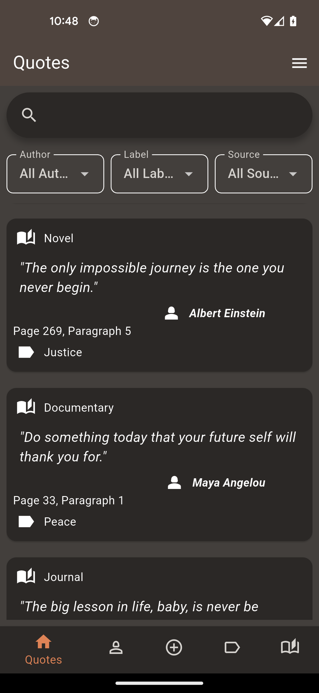
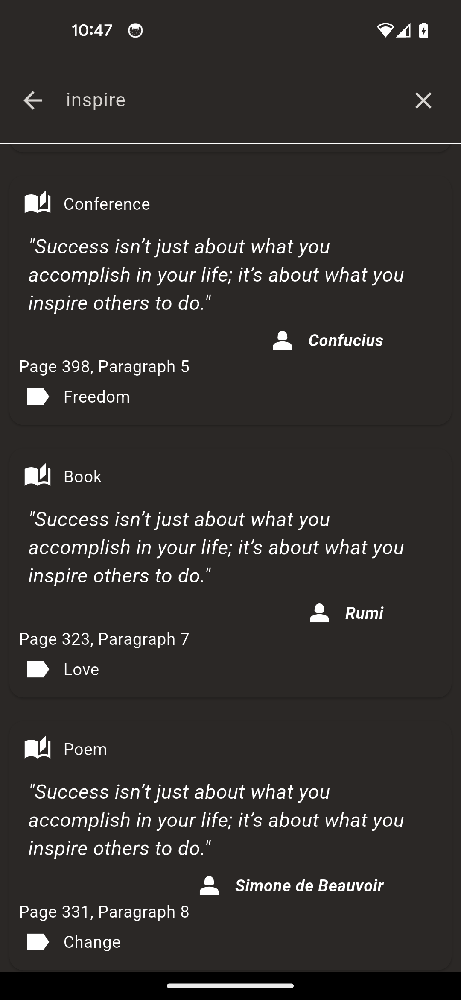
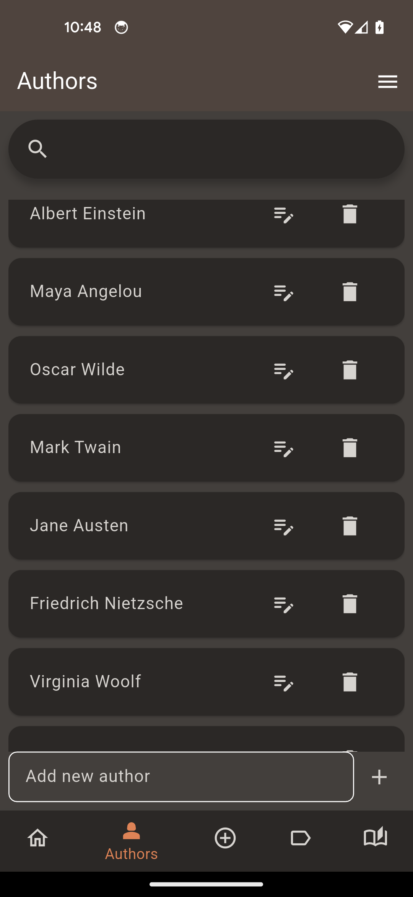

# 📖 Quoting
**Capture, organize, and search your favorite quotes with lightning speed.**

[](https://flutter.dev)
[](https://dart.dev)
[](https://bloclibrary.dev)
[](https://drift.simonbinder.eu)
[](LICENSE)
[](https://github.com/AngeloAG/Quoting)

Quoting is a Flutter app that lets you capture, organize, and revisit quotes from books, talks, and presentations.
Unlike many existing quote apps, Quoting is built with a focus on scalability, clean architecture, and blazing-fast search performance — so whether you save 10 quotes or 10,000, lookup stays smooth and instant.

Future plans include account login, cloud sync, and a web version, so you’ll be able to keep your favorite quotes accessible across all your devices.

---

## ✨ Features

- 📚 **Save & organize quotes** with details like author, source, and labels  
- ⚡ **Optimized full-text search** powered by [Drift](https://drift.simonbinder.eu/) & SQLite indexing  
- 🧩 **Clean Architecture** principles for maintainable, testable code  
- 🔄 **State management with BLoC** for predictable and reactive UI  
- 💾 **Offline-first** design — your quotes are always available, even without internet  
- 📝 **Database explorer** via `drift_db_viewer` for debugging & development  
- 🚀 **Future-ready**: planned login, sync across devices, and a web version  

---

## 🛠️ Tech Stack

- **Flutter** – UI toolkit for cross-platform apps  
- **BLoC & Hydrated BLoC** – State management with persistence  
- **Drift + sqlite3 + sqlite3_flutter_libs** – High-performance local database with advanced indexing  
- **fpdart** – Functional programming patterns in Dart  
- **MediatR & get_it** – Dependency injection & request/response abstraction  
- **Beamer** – Declarative routing and navigation  
- **flutter_lazy_indexed_stack** – Efficient navigation with preserved state  
- **drift_db_viewer** – Inspect the database during development  
- **path_provider & file_selector** – File system access  

---

## 🚀 Getting Started

### Prerequisites
- [Flutter SDK](https://docs.flutter.dev/get-started/install) (>= 3.9.0)
- Dart SDK (>= 3.9.0)

### Installation
Clone the repository:
```bash
git clone https://github.com/AngeloAG/quoting.git
cd quoting
```
Install dependencies:
```
flutter pub get
```
Run the app:
```
flutter run
```

---

## 📂 Project Structure (Clean Architecture)

```
lib/
├── application/    # Use cases and operations
├── domain/         # Entities & business logic
├── infrastructure/ # Database, services, repositories
├── presentation/   # UI layer (Flutter widgets and BLoC & state management)
```

---

## 📸 Screenshots

<p align="center">     </p>

---

## 🗺️ Roadmap
- Add user authentication
- Cloud sync for multi-device support
- Web version (Flutter Web)
- Quote sharing & exporting options
- Improved theming & customization

---

## 🤝 Contributing
Contributions, ideas, and feedback are welcome!
Feel free to open an issue
 or submit a pull request

--- 

## 📜 License
This project is licensed under the **MIT License** — see the [LICENSE](quoting/LICENSE) file for details.
